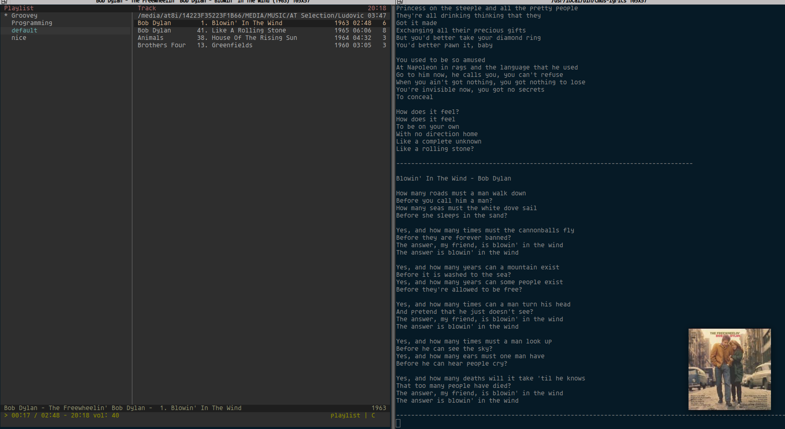

# CMUS setup for your Ubuntu or Ubuntu based distro #
A complete cmus setup with lyrics, cover arts and tag edit setup. It also downloads the lyrics to
`/home/USERNAME/lyrics` in `{$ARTIS}_{$TITLE}_lyrics_1.txt` for future use. You can change them
all to .lrc files if you want. And cover art for cmus which will be in track's folder.
1. [Installation](#Installation)
1. [Status Display Program](#Status-Display-Program)
1. [Edit Tag](#Edit-Tag)
1. [What it will look like](#What-it-will-look-like)
## Installation
Follow below steps:
1. Install glyrc `sudo apt install glyrc` or compile from source [Glyr](https://github.com/sahib/glyr).
2. Install cmus `sudo apt install cmus`(used to fetch lyrics).
3. Install wget `sudo apt install wget`(used to fetch lyrics).
4. Install jq `sudo apt install jq`(used to fetch lyrics).
5. Install awk `sudo apt install mawk`(used to fetch lyrics).
6. Install mp3infor `sudu apt install mp3info` (used to edit tag of mp3 files).
7. Install feh `sudo apt install feh`(used to display cover art).
8. Install terminator `sudo apt install terminator` (try your own terminal see if it works, need to change it for your own setup in the files).
9. Download the file: `git clone  https://github.com/at8i/cmus-setup`.
10. cd into the folder: `cd cmus-setup`.
11. Make all the file executable and move the into `/usr/local/bin`.
```
sudo apt install glyrc cmus wget jq mawk terminator feh &&
git clone  https://github.com/at8i/cmus-setup &&
cd cmus-setup &&
sudo chmod +x cmus-artget.sh cmus_edit_tag cmus_plugins.sh cmus-lyrics cmus-feh.sh &&
sudo mv -f cmus-artget.sh cmus_edit_tag cmus_plugins.sh cmus-lyrics cmus-feh.sh /usr/local/bin/
```
Now all your files are in place.

## Status Display Program
Follow steps below to setup your status display program in cmus:
1. Open terminal and execute `cmus`.
2. In cmus execute this command: `:set status_display_program=/usr/local/bin/cmus_plugins.sh`
3. Restart cmus and play a song now you should be able to see cover art and lyrics.
Position lyrics terminator window wherever you want.

## Edit Tag
Follow steps below to be able to edit tag of the tracks you want:
1. Open cmus in a terminal.
2. And execute this command but use any other binding instead of 0:
`:bind -f common 0 shell /usr/local/bin/cmus_edit_tag`
3. Now restart cmus.
4. If you press your binding for edit tag command, a window will pop up and you can edit the
fields and press enter at the end to save and quit or ctrl-C to cancel the changes and quit.

## What it will look like
If you are using Gnome desktop [cmus status extension](https://extensions.gnome.org/extension/1934/cmus-status/) is recommended.

